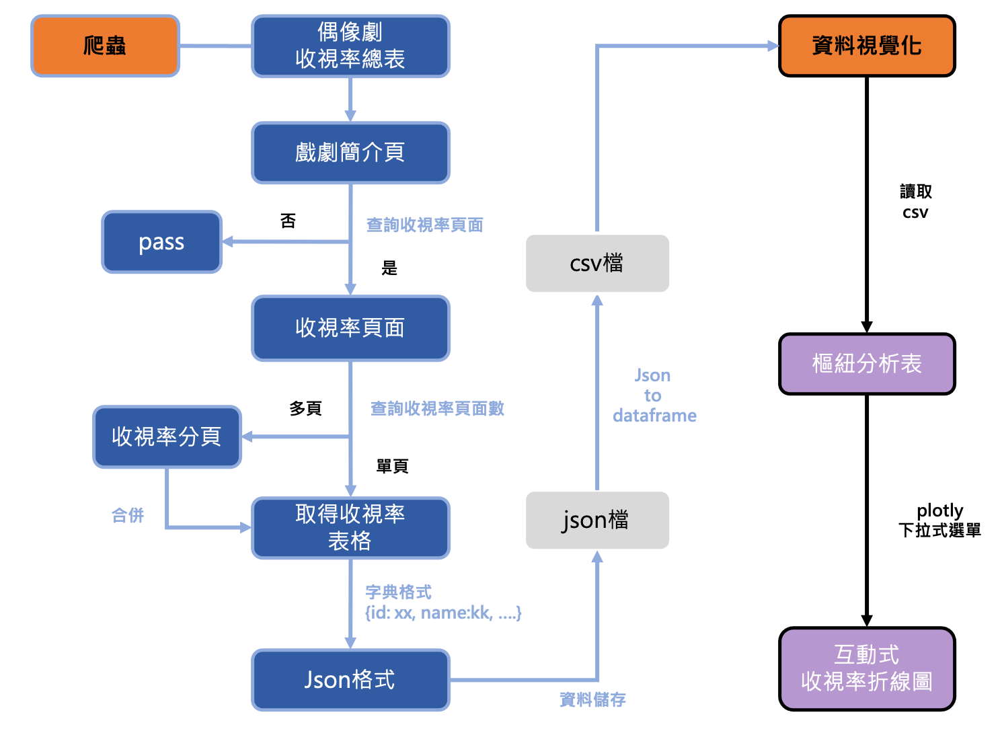

2020 日本偶像劇收視率 爬蟲 & 視覺化

### 簡介
此爬蟲程式抓取 [日本偶像劇場](http://dorama.info/drama/d_rate.php) 所提供的資料，資料內容為日本2020年上映的電視劇在關東地區的家庭收視率。  

在網站上，這些資料是以結構較複雜的表格所呈現，此程式將這些資料轉換成json檔與csv檔以方便運用。最後運用csv檔將資料進行簡單的視覺化。

### 檔案目錄
```
Crawler  
├── main_process.py             # 主執行檔
├── crawler_v4.py               # 爬蟲
├── drama_rating_to_df.py       # json to csv
├── data_visuliation.py         # 視覺化
└── data
    ├── drama_rating.json       # crawler_v4.py 的 output
    └── drama_rating_df.csv     # drama_rating_to_df.py 的 output
```

### 流程圖


